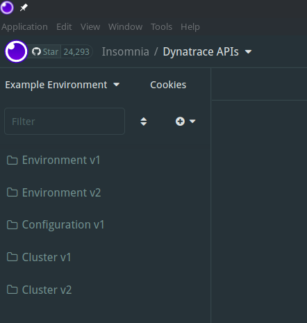
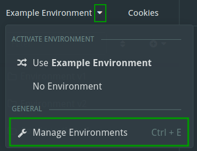
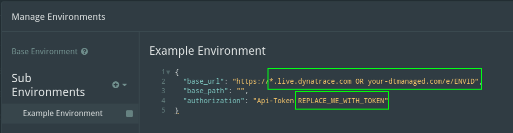

# Insomnia Collections for Dynatrace APIs
This is a summary of [insomnia](https://insomnia.rest/) collections for all dynatrace APIs.  
I've added variables to make them easy to use with multiple dynatrace clusters, environments and tenants by utilizing [Environment Variables](https://docs.insomnia.rest/insomnia/environment-variables)

The master branch includes the latest version, older versions are available as tags or in the releases.

# How to

## Import collections
Import (`Application -> Preferences -> Data -> Impot Data`) .json file for the [APIs](specs/Dynatrace-All-APIs.json).

A collection `Dynatrace APIs` will be created with subfolders for each API:  

## Create environments
For each of your dynatrace environments you want to use, add a insomnia environment `environment dropdown -> Manage Environments`:  

You can adapt the `Example Environment` or create new ones based on it, you need to adjust the following:
* base_url
  * URL to the environments
    * For managed: `https://your-dt-domain.com/e/Environment-ID`
      * `https://example.com/e/b80b158e-ev23-4330-30fcc-c4391bbx6ce2`
    * For managed (Cluster API): `https://your-dt-domain.com`
      * `https://example.com`
    * For SaaS: `https://Env-ID.live.dynatrace.com`
      * `https://abc133769.live.dynatrace.com`
* authorization
  * Enter the token instead of `REPLACE_ME_WITH_TOKEN`
    * `Api-Token dt01.PUBLIC.SECRET`

## Request away!

Now you can open any request and easily execute it against different dynatrace environments by selecting the environment on the top left.

# Create update for new API version

* Delete old versions from insomnia
* Import all OpenAPI specs via Application --> Preferences --> Data --> Impot Data
  * Be careful to import everyting to a separate workspace (Type: request collection)
* Export all Collections via Application --> Preferences --> Data --> Export Data
* Format files (vscode auto json format)
* run convert.sh
* Collections ready for import